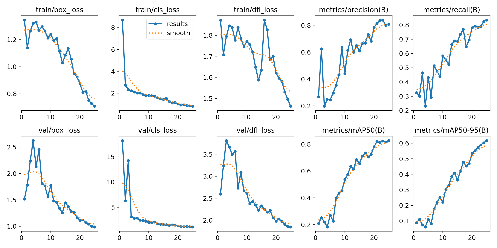

## Oceano Vivo

Integrantes: 

- LUCCA RAPHAEL PEREIRA DOS SANTOS - RM:99675   

- BIANCA LETICIA ROMÁN CALDEIRA - RM:552267   

- CHARLENE APARECIDA ESTEVAM MENDES FIALHO - RM:552252   

- LAIS ALVES DA SILVA CRUZ - RM:552258   

- FABRICIO TORRES ANTONIO - RM:97916  

### Video

[Video IA](https://youtu.be/t4EimxNCcBM)

### Descrição do Problema
A pesca predatória e a sobrepesca representam uma das maiores ameaças aos ecossistemas marinhos, colocando mais de 90% dos estoques de peixes marinhos em risco. Atualmente, 33,1% desses estoques estão sobre-explorados e em declínio populacional. Esta situação crítica exige medidas urgentes para a conservação da biodiversidade marinha e a sustentabilidade dos recursos pesqueiros. Além dos peixes, muitas outras espécies marinhas, como tartarugas, tubarões e mamíferos marinhos, também enfrentam sérias ameaças devido às atividades humanas, incluindo a pesca, a poluição e a destruição de habitats.

Mais de 30% das espécies de tubarões e raias estão ameaçadas de extinção. Todas as sete espécies de tartarugas marinhas estão ameaçadas, com algumas em perigo crítico. Várias espécies de baleias, golfinhos e focas estão em risco devido à caça e à captura acidental em redes de pesca. Quanto aos peixes, mais de um terço das espécies comerciais estão sobrepescadas, e algumas, como a Carapitanga estão em grave risco de extinção devido à pesca excessiva e à alta demanda comercial.

### Metodologia
Para enfrentar este problema, desenvolvemos a plataforma "Oceano Vivo", que utiliza uma inteligência artificial (IA) capaz de reconhecer espécies marinhas em extinção. O objetivo é permitir que pescadores e outros usuários identifiquem rapidamente essas espécies e as devolvam ao mar, contribuindo para a conservação das mesmas. Além disso, a plataforma serve como uma ferramenta de conscientização, educando a população sobre a importância de preservar a vida marinha.

#### Etapas do Desenvolvimento
1. **Coleta de Dados**: Utilizamos a ferramenta Roboflow para criar um dataset robusto contendo imagens de diversas espécies marinhas ameaçadas de extinção. Esse dataset foi etiquetado com precisão para garantir a qualidade do treinamento da IA.
2. **Treinamento da IA**: Empregamos o modelo YOLOv8 para o treinamento do sistema de reconhecimento de espécies. O YOLOv8 é conhecido por sua eficiência e precisão em tarefas de detecção de objetos, sendo adequado para aplicações em tempo real.
3. **Validação e Testes**: Realizamos extensivos testes para validar a precisão do modelo treinado. O sistema foi avaliado em termos de porcentagem de acerto garantindo que a IA fosse confiável e prática para uso na plataforma.

### Resultados Obtidos
A plataforma "Oceano Vivo" demonstrou resultados promissores, com uma alta taxa de acerto na identificação de espécies marinhas em extinção. A seguir estão alguns dos resultados detalhados obtidos pela nossa IA:

**Localização Precisa**
A métrica val/box_loss varia entre 1.0 e 2.5 o que indica a capacidade da IA de localizar objetos com precisão, mesmo em novos dados.

**Identificação de Recursos Refinada**
A métrica val/dfl_loss, que varia entre 2.0 e 3.5, indica um refinamento na identificação de recursos visuais, essencial para a precisão do sistema de detecção de objetos.

**Detecção de Objetos Confiável**
A métrica mAP50(B) aumentou de 0.1 para 0.8, comprovando a alta performance da IA na detecção de objetos com sobreposição de 50% ou mais com a realidade, garantindo resultados confiáveis.

**Desempenho Consistente em Diferentes Cenários**
A métrica mAP50-95(B) aumentou de 0.0 para 0.6, demonstrando a capacidade da IA de manter um bom desempenho em situações com diferentes níveis de sobreposição entre os objetos detectados e a realidade.

### Conclusões
Os resultados indicam que a IA desenvolvida é uma ferramenta eficaz para a identificação de espécies marinhas ameaçadas. Com uma alta taxa de precisão e rápida resposta, a "Oceano Vivo" tem o potencial de ser um recurso valioso para pescadores e conservacionistas, ajudando a reduzir a captura acidental de espécies em risco e promovendo a conscientização sobre a preservação da vida marinha.

### Futuro da Plataforma
Embora os resultados iniciais sejam encorajadores, há espaço para melhorias e expansões futuras:
- **Aumento do Dataset**: Coletar mais dados e incluir novas espécies marinhas para aprimorar ainda mais a precisão e abrangência da IA.
- **Melhorias no Modelo**: Continuar refinando o modelo YOLOv8 e explorar outras arquiteturas de IA para melhorar o desempenho.
- **Conscientização e Educação**: Integrar recursos educacionais à plataforma para aumentar a conscientização sobre a importância da conservação marinha entre os usuários.

O "Oceano Vivo" se apresenta como uma solução inovadora e viável para enfrentar os desafios da conservação marinha, com o potencial de fazer uma diferença significativa na proteção das espécies marinhas ameaçadas.